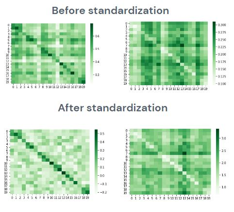
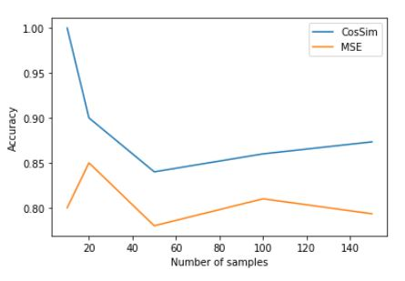

# NLP Adapter challenge: Aligning translations by embedding similarity

The idea of this notebook (run in google colab) is to use pre-trained models to find translation Czech-English pairs.

## Idea

We want to find a method that can find corresponding translation pairs from similarities of text embeddings.
In particular, we want to align CS<>EN translations of the [TED dataset](https://www.cs.jhu.edu/~kevinduh/a/multitarget-tedtalks/).

For this task, [Sentence Transformers](https://arxiv.org/abs/1908.10084) would be more useful, since they find embeddings for sentences, and not word-by-word.
However, I restrict to using simpler architectures.

## What did I try to do?

- From a [TED dataset](https://www.cs.jhu.edu/~kevinduh/a/multitarget-tedtalks/), compute sentence embeddings using [BERT](https://arxiv.org/abs/1810.04805). 
- Find a similarity metric for embeddings (for matching translations)
- Train [Adapters](https://arxiv.org/pdf/1902.00751.pdf) on the [BERT models](https://arxiv.org/abs/1810.04805) to fine-tune to this task

## Models used

I use pretrained [Bidirectional Transformers for Language Understanding](https://arxiv.org/abs/1810.04805) models, to compute sentence embeddings for Czech and English sentences.

We need models that contain information of the Czech language.
Therefore models such as [bert-base-cased](https://huggingface.co/bert-base-cased?text=Paris+is+the+%5BMASK%5D+of+France) do not work.
I use [bert-base-multilingual-cased](https://huggingface.co/bert-base-cased?text=The+goal+of+life+is+%5BMASK%5D)  trained in a self-supervised fashion for the tasks of Masked Language Modeling and Next Sentence Prediction.

We expect this models to contain valuable information on the meaning of different sentences.

I use the intermediate representation on the pre-trained network of the given sentences as embeddings.
In particular, I use the last layer, which should contain higher-level information on the meaning of the sentences.

The embeddings of a BERT (naive) transformer contain contextualized work embeddings; not directly sentence embeddings. 
I use mean-pooling to convert this embedding into “sentence-embeddings”.

## Similarity metrics

We may use [cosine similarity](https://en.wikipedia.org/wiki/Cosine_similarity) or [mean squared error](https://en.wikipedia.org/wiki/Mean_squared_error).

The cosine similarity measures how much to embeddings point to the same direction.
The mean squared error is the euclidean distance of the embeddings.

We expect that sentences with the same meaning (being translations one of each other) point to the same dimension and their embeddings are close.

This, however, depends on how the pre-trained model was trained, for which task, on the data using for training, ….

For 100 samples of the data, we get that the cosine similarity on translation pairs is 0.491, and the MSE is 0.218
If we randomly change the ordering, the cosine similarity becomes 0.176 and the MSE distance 0.264.

## Towards a better metric

A performance metric can consist in checking if, for a row, the maximum (or minimum) value is in the diagonal. If it is, it is counted as 1, and else as 0. 
The mean of this value can be seen as a measure of accuracy.

For 100 samples of the TED dataset, the performance (“accuracy”) metric is 0.68 for CosSim and 0.55 for MSE.
A random selection would lead an "accuracy" metric of 0.01.

## PCA representations

A [PCA](https://en.wikipedia.org/wiki/Principal_component_analysis) representation of the embeddings can give interesting visual representation of the data.

We can also use the PCA representation to check whether translation pairs embeddings' PCA representations are closer to eachother.

## Standardizing the data

We can see that there is a "bias" on the PCA representation of the embeddings for Czech and English sentences.
We can try to solve this by standardizing the Czech and English embeddings separately.

We observe that by standardizing the embeddings for each language separately we improve the "confusion matrices".

With standardization, the baseline metric is 0.82 for CosSim and 0.69 for MSE.
Without standardization, the baseline metric is 0.68 for CosSim and 0.55 for MSE.

## Results for monolingual models
We can also use [bert-base-cased](https://huggingface.co/bert-base-cased?text=Paris+is+the+%5BMASK%5D+of+France), which has not been trained on the Czech language, to check if the metrics and plots make sense .

## Using adapters

An Adapter is a module added between layers of a pretrained transformer model.  It adds bottleneck architectures and freezes the pre-trained weights of the network.

Adapters provide an alternative to fully fine-tuning the model for each downstream task, while maintaining performance. We need few trainable parameters (just the added ones!).

I (try to) implement an adapter model on top of a BERT model bert-base-multilingual-cased .
We want to train this adapter to maximize embedding similatirity between translation pairs. 
I use the WMT’19 dataset for training (the TED dataset is for validation).

## Naive loss

We want to maximize the similarity (minimize the distance) between translations.
A naive candidate for a loss function can be
Loss(x,y) = - Similarity(x,y) for (x,y) being embeddings of aligned translated sentences (x CS, y EN).

However, a trivial minimization of this problem would be to make all (x,y) closer, thus the fine-tuned model could just project all embeddings into the same region.
This would hurt (or not necessarily help) the performance metric, since the similarity matrix would be filled with ones (not diagonal).

## Improved loss

We need to give examples of non-aligned sentences, and take that into account for the loss function.
Consider (x,y) are embeddings of aligned translations, and (x’,y’) are not aligned. Then,
Loss(x,y,x’,y’) = -Similarity(x,y) + Similarity(x’,y’) is a better option for a loss function.

To avoid complicating the training pipeline, I do the following. Consider x,y being each a list of embeddings of aligned translations. 

The loss can be defined as
Loss(x,y) = -Similarity(x,y) + Similarity(x[::-1],y) 
Where x[::-1] is a flipped version of x. This way, we are sure that x[::-1] and y are not aligned, without the need for randomly permuting and making sure that none of the indices coincide.

## Preliminary results
Plots of the evolution of the "confusion matrices" or PCA plots using adapters. These indicate that the implementation is not quite correct or optimal (I should further work on this!). Probably, it is due to having a bad (non-convex, and not class-weighter) loss function.

### Using a naive loss, without standardizing

### Using a better loss

## Further work

There’s a high probability that some of my implementations are incorrect, and that some “results” are purely numerical (meaning: the experiments are doing what I told them to do, without knowing that I told them to do that). So, a first step would be:
Check that the code is somehow correct.
Indeed: it’s not. I have not trained the LayerNorms with the adapters; although the code “”supports this”” now, too late to report results!
Try to spot more implementation errors.

Assumption: all the previous is solved. Then,
Create a performance metric that scales better with the whole TED dataset (running out of memory for more than 200 sentences). 
Do a more systematic parameter study to see what’s actually happening (change similarity metric on the loss function, …)
Understand better what the models are (how were they trained? What was the loss used?, …)
See what similarities are between the TED and the WMT’19 dataset
The embedding with a naive BERT is not quite good for sentences. Maybe the presence of specific words on the WMT’19 dataset affects the training of the adapters

